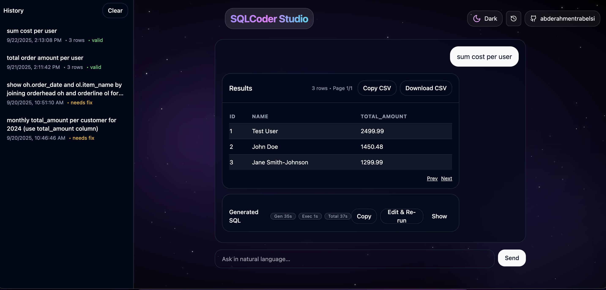

# NL→SQL for ERP — Go + FastAPI + llama.cpp (SQLCoder 7B v2 GGUF)

Production-grade natural language to SQL pipeline built around a local SQLCoder 7B v2 (GGUF, QuantFactory) model via llama.cpp, a Python FastAPI microservice for generation/validation, and a Go API for safe SQL execution and integration.

## UI Screenshot



Key goals

- High precision and accuracy on ERP-style queries
- Deterministic generation (temperature 0) with schema grounding
- Hallucination detection with interactive repair suggestions
- Safe, SELECT-only execution with transparent SQL

Architecture

```
 ┌──────────────────────────┐        ┌──────────────────────────────────────┐
 │        Frontend         │  NL    │                Go API                │
 │  (chat + repair UX)     ├────────▶  /api/v1/nl2sql/* routes             │
 └──────────────────────────┘        │  routes/nl_sql_routes.go             │
                                      │  controllers/nl_sql_controller.go    │
                                      │  services/nl_sql_service.go          │
                                      └──────────────┬───────────────┬──────┘
                                                     │               │
                                          Generate/Repair/Feedback   │ Execute (SELECT-only)
                                                     │               │
                                                     ▼               ▼
                                      ┌──────────────────────────────────────┐
                                      │          Python FastAPI NLSQL        │
                                      │  python_api/main.py                  │
                                      │  - Schema grounding from             │
                                      │    python_api/schema.json            │
                                      │  - llama.cpp via SQLCoder 7B v2      │
                                      │  - Prompt template + n-best rerank   │
                                      │  - SQL validation + suggestions      │
                                      └───────────────────┬──────────────────┘
                                                          │
                                                          ▼
                                          ┌────────────────────────────────┐
                                          │        MySQL (via GORM)        │
                                          │  config/database.go            │
                                          │  models/*.go                   │
                                          └────────────────────────────────┘
```

Repository layout

- [main.go](main.go): bootstraps the Go server and routes
- [config/database.go](config/database.go): DB connection + migrations
- [models/user.go](models/user.go), [models/order.go](models/order.go): sample ERP tables
- [services/nl_sql_service.go](services/nl_sql_service.go): HTTP client to Python and safe SQL execution
- [controllers/nl_sql_controller.go](controllers/nl_sql_controller.go): NL→SQL/repair/feedback/execute endpoints
- [routes/nl_sql_routes.go](routes/nl_sql_routes.go), [routes/routes.go](routes/routes.go): route wiring
- [python_api/main.py](python_api/main.py): llama.cpp-backed generator + validator + rerank + template
- [python_api/schema.json](python_api/schema.json): ERP schema + relationships + synonyms (accuracy bias)
- [python_api/prompt_template.txt](python_api/prompt_template.txt): external prompt template (optional)
- [llm-models/sqlcoder-7b-2.Q4_K_M.gguf](llm-models/sqlcoder-7b-2.Q4_K_M.gguf): recommended local model
- Frontend (React + Vite):
  - [frontend/vite.config.ts](frontend/vite.config.ts)
  - [frontend/src/App.tsx](frontend/src/App.tsx)
  - [frontend/src/components/ChatPanel.tsx](frontend/src/components/ChatPanel.tsx)
  - [frontend/src/components/HistoryPanel.tsx](frontend/src/components/HistoryPanel.tsx)
  - [frontend/src/components/ui/toast.tsx](frontend/src/components/ui/toast.tsx)

Quick start

Prerequisites

- Python 3.10+ and Go 1.21+
- MySQL running and reachable (for execute)
- jq: brew install jq

1) Start Python NL→SQL (one-liner, after installing requirements)

- First time only, install requirements (example):
  - python3 -m venv .venv-llama && source .venv-llama/bin/activate && pip install -r python_api/requirements.txt

- Then run the service (SQLCoder default, tuned for M1 8GB):
```
source .venv-llama/bin/activate && LLAMA_MODEL_PATH="$PWD/llm-models/sqlcoder-7b-2.Q4_K_M.gguf" LLAMA_THREADS=6 LLAMA_N_GPU_LAYERS=24 LLAMA_N_BATCH=256 LLAMA_CTX=1536 LLAMA_MAX_TOKENS=128 uvicorn python_api.main:app --host 127.0.0.1 --port 7337
```

Notes:
- The code defaults to SQLCoder if LLAMA_MODEL_PATH is not set: see [MODEL_PATH default](python_api/main.py:25)
- Adjust threads/layers/batch if needed for your Mac.

Warm‑up and health
- The service pre‑warms the model at startup so the first request is fast. While warming, the API may respond with a fast 503 warming_up instead of hanging.
- Check readiness:
  curl -s http://127.0.0.1:7337/health | jq '{model:.model_path,warm:.warm,warm_error:.warm_error}'
  When "warm": true, the model is ready.
- If you see warming_up, retry after a second; this avoids long frontend timeouts.

Or, if you already set these envs once in a .env at project root (loaded by [python_api/main.py](python_api/main.py)):
- LLAMA_MODEL_PATH=./llm-models/sqlcoder-7b-2.Q4_K_M.gguf
- PROMPT_TEMPLATE_PATH=./python_api/prompt_template.txt
- NLSQL_N_BEST=3
- LLAMA_CTX=2048
- LLAMA_MAX_TOKENS=128
- LLAMA_THREADS=8
- LLAMA_N_GPU_LAYERS=-1

Then you can start with a single command (no re-exports needed):
```
source .venv-llama/bin/activate && uvicorn python_api.main:app --host 127.0.0.1 --port 7337 --reload
```

Warm the model once (first call can take 1–3 minutes):

```
curl -sS -X POST http://127.0.0.1:7337/nl2sql \
  -H 'Content-Type: application/json' \
  -d '{"query":"ping"}' | jq .
```

2) Start Go API

```
cd ./    # project root
test -f .env || cp .env.example .env
export NLSQL_URL=http://127.0.0.1:7337
export NLSQL_TIMEOUT_SECONDS=600   # allow long first request
go run .
```

3) Start Frontend (React + Vite)

```
cd ./frontend
npm install
npm run dev
# open http://localhost:5173
# Vite proxies API calls to http://localhost:8080 (see [frontend/vite.config.ts](frontend/vite.config.ts))
```

Frontend UX
- Top search box with “NL → SQL” pill; examples inline; results/messages below.
- Thinking timer (seconds) while generating; after completion see Gen / Exec / Total secs in the SQL card.
- Results table; collapsible SQL with Edit & Re-run.
- Hallucination repair dropdown (invalid tables/columns get suggestions).
- History panel (clicking an item resends the query automatically).
- Modern toast errors when backend is down or responses are invalid.
- Theme toggle + animated background.
Key files: [frontend/src/components/ChatPanel.tsx](frontend/src/components/ChatPanel.tsx), [frontend/src/components/MessageBubble.tsx](frontend/src/components/MessageBubble.tsx), [frontend/src/components/ui/toast.tsx](frontend/src/components/ui/toast.tsx).


Health checks

```
curl -s http://127.0.0.1:7337/health | jq .
curl -s http://localhost:8080/health | jq .
```

Verification and diagnostics

- Check DB fallback flag
```
curl -s http://127.0.0.1:7337/health | jq '{db_fallback:.db_fallback,db:.db_name}'
```

- Preview schema slicing (no generation)
```
curl -s 'http://127.0.0.1:7337/schema?slice=true&q=sum%20cost%20per%20user' | jq '.selected_tables,.schema.tables|keys'
```

- JSON-first path (should show schema_source "json")
```
curl -sS -X POST http://localhost:8080/api/v1/nl2sql \
  -H 'Content-Type: application/json' \
  -d '{"query":"total order amount per user"}' | jq '{source:.schema_source,sliced:.sliced_tables,valid:.valid}'
```

- DB fallback path (uses new column e.g. "cost")
```
curl -sS -X POST http://localhost:8080/api/v1/nl2sql \
  -H 'Content-Type: application/json' \
  -d '{"query":"sum cost per user"}' | jq '{source:.schema_source,sliced:.sliced_tables,valid:.valid}'
```

Tip: when splitting curl across lines in zsh, end lines with backslashes.

End-to-end usage

Generate SQL

```
curl -sS -X POST http://localhost:8080/api/v1/nl2sql \
  -H 'Content-Type: application/json' \
  -d '{"query":"total order amount per user"}' | jq .
```

Repair with suggestions (simulate hallucinated tables)

```
curl -sS -X POST http://localhost:8080/api/v1/nl2sql/repair \
  -H 'Content-Type: application/json' \
  -d '{"sql":"SELECT oh.order_date, ol.item_name FROM orderhead oh JOIN orderline ol ON oh.id = ol.order_id;","corrections":{"tables":{"orderhead":"orders","orderline":"orders"}}}' | jq .
```

Execute generated SQL (SELECT-only; requires DB)

```
SQL=$(curl -sS -X POST http://localhost:8080/api/v1/nl2sql \
  -H 'Content-Type: application/json' \
  -d '{"query":"total order amount per user"}' | jq -r '.sql')
jq -nc --arg sql "$SQL" '{sql:$sql}' | curl -sS -X POST \
  http://localhost:8080/api/v1/nl2sql/execute \
  -H 'Content-Type: application/json' \
  --data-binary @- | jq .
```

Error feedback loop (let the model fix real DB errors)

```
curl -sS -X POST http://localhost:8080/api/v1/nl2sql/feedback \
  -H 'Content-Type: application/json' \
  -d '{"sql":"SELECT u.name, SUM(o.ammount) FROM users u JOIN orders o ON o.user_id=u.id GROUP BY u.name;","error":"Unknown column ammount in field list"}' | jq .
```

Testing plan (users/orders DB)
- UI (http://localhost:5173)
  1) total order amount per user
     - Expect: SUM(orders.amount) grouped by users; join on orders.user_id = users.id.
  2) Orders in the last 30 days for user with email alice@example.com
     - Expect: filter by users.email and orders.order_date range.
  3) count of orders by status
     - Expect: GROUP BY orders.status with counts.
  4) Hallucination repair demo
     - Enter a query that uses non-existent tables (e.g., orderline). UI shows suggestions (e.g., orders). Use dropdown to repair and re-run.
  5) Backend-down handling
     - Stop Python service and submit a query. UI shows a toast; app doesn’t crash.

- cURL (Go API)
  - Generate:
    curl -sS -X POST http://localhost:8080/api/v1/nl2sql -H 'Content-Type: application/json' -d '{"query":"total order amount per user"}' | jq .
  - Execute:
    SQL=$(curl -sS -X POST http://localhost:8080/api/v1/nl2sql -H 'Content-Type: application/json' -d '{"query":"count of orders by status"}' | jq -r '.sql'); jq -nc --arg sql "$SQL" '{sql:$sql}' | curl -sS -X POST http://localhost:8080/api/v1/nl2sql/execute -H 'Content-Type: application/json' --data-binary @- | jq .
  - Repair (hallucinated tables):
    curl -sS -X POST http://localhost:8080/api/v1/nl2sql/repair -H 'Content-Type: application/json' -d '{"sql":"SELECT oh.order_date, ol.item_name FROM orderhead oh JOIN orderline ol ON oh.id = ol.order_id;","corrections":{"tables":{"orderhead":"orders","orderline":"orders"}}}' | jq .

Local DB + schema (visibility)
- Tables are created locally via Go models: [models/user.go](models/user.go), [models/order.go](models/order.go).
  - users: id, name, email, phone, address, created_at, ...
  - orders: id, user_id, order_number, amount, status, order_date, ...
  - Relationship: orders.user_id → users.id
- View schema JSON:
  - All: curl -s http://127.0.0.1:7337/schema | jq .
  - Sliced for a query: curl -s 'http://127.0.0.1:7337/schema?slice=true&q=total%20order%20amount%20per%20user' | jq .
- Peek data directly in MySQL (example):
  - SELECT * FROM users LIMIT 5;
  - SELECT * FROM orders ORDER BY order_date DESC LIMIT 5;
- You can cross-check UI results with direct SQL, e.g.:
  - SELECT u.id, u.name, SUM(o.amount) AS total_amount FROM users u JOIN orders o ON o.user_id = u.id GROUP BY u.id, u.name ORDER BY total_amount DESC;

How it works

1) Schema grounding (JSON-first)
   - Default source of truth is [python_api/schema.json](python_api/schema.json).
   - The Python service injects this JSON, plus few-shot examples, into the prompt.
   - For performance, the service slices the schema to only relevant tables based on the query (see below).

2) Schema slicing (performance)
   - Only a subset of tables likely relevant to the NL query are included (keyword scoring + relationship expansion).
   - Max tables is configurable via SCHEMA_SLICE_MAX_TABLES (default 8).

3) DB fallback (only when JSON is missing objects)
   - If generated SQL is invalid due to missing tables/columns not present in JSON, the service retries with live DB schema reflection automatically.
   - Controlled via SCHEMA_DB_FALLBACK (default true) and DB_* envs.

4) Deterministic generation
   - llama.cpp with SQLCoder 7B v2 GGUF, temperature 0, bounded max tokens.
   - Prompt crafted to emit a single MySQL SELECT statement ending with a semicolon.

5) Validation and suggestions
   - SQL is parsed to extract used tables and columns.
   - Any table/column not in the schema is flagged as a hallucination.
   - Closest matches suggested via difflib to repair interactively.

6) Repair
   - Frontend can post corrections (tables/columns); backend applies them and re-validates.

7) Error feedback loop
   - If execution fails (e.g., “Unknown column”), the error text is fed back into a corrective prompt for regeneration.

8) Safe execution
   - Go service enforces single-statement, SELECT-only, and blocks DDL/DML keywords before execution.
   - Execution happens via GORM’s Raw on the configured MySQL connection.

Configuration
- SCHEMA_DB_FALLBACK=true   # retry with live DB schema if JSON misses objects
- SCHEMA_SLICE_MAX_TABLES=12
- DB_HOST/DB_PORT/DB_USER/DB_PASSWORD/DB_NAME   # required for fallback to work

API surface

Go API (prefix /api/v1)

- POST /nl2sql → generate SQL + validation
- POST /nl2sql/repair → apply user corrections and revalidate
- POST /nl2sql/feedback → regenerate using DB error feedback
- POST /nl2sql/execute → execute validated SELECT and return rows

Python FastAPI

- POST /nl2sql → generate and validate SQL
- POST /nl2sql/repair → apply corrections and validate
- POST /nl2sql/feedback → fix SQL using error text
- GET /health → basic status

Safety, constraints, and transparency

- SELECT-only enforcement and multi-statement blocking in the Go layer
- SQL always returned to users for transparency
- No schema writes; migrations only at startup via GORM

Performance and tuning

- First request warms the model and can take 1–3 minutes; later calls are fast
- Environment variables:
  - LLAMA_THREADS, LLAMA_CTX, LLAMA_MAX_TOKENS
  - NLSQL_TIMEOUT_SECONDS (Go client timeout)
  - NLSQL_CACHE_TTL_SECONDS / NLSQL_CACHE_MAX_ENTRIES (Python NL→SQL cache)
  - EXEC_CACHE_TTL_SECONDS / EXEC_CACHE_MAX_ENTRIES (Go DB result cache)
- Keep few-shot examples concise to reduce latency

Caching quick test

- NL→SQL cache (call twice; second should be much faster)
```
time curl -sS -X POST http://localhost:8080/api/v1/nl2sql -H 'Content-Type: application/json' -d '{"query":"total order amount per user"}' > /dev/null
time curl -sS -X POST http://localhost:8080/api/v1/nl2sql -H 'Content-Type: application/json' -d '{"query":"total order amount per user"}' > /dev/null
```

- DB result cache (call twice; second should be much faster)
```
SQL=$(curl -sS -X POST http://localhost:8080/api/v1/nl2sql -H 'Content-Type: application/json' -d '{"query":"total order amount per user"}' | jq -r '.sql')
time jq -nc --arg sql "$SQL" '{sql:$sql}' | curl -sS -X POST http://localhost:8080/api/v1/nl2sql/execute -H 'Content-Type: application/json' --data-binary @- > /dev/null
time jq -nc --arg sql "$SQL" '{sql:$sql}' | curl -sS -X POST http://localhost:8080/api/v1/nl2sql/execute -H 'Content-Type: application/json' --data-binary @- > /dev/null
```

Troubleshooting

- “context deadline exceeded”: increase NLSQL_TIMEOUT_SECONDS and warm Python with a direct call
- “Unknown column/table”: use /nl2sql/repair suggestions or feed the exact DB error to /nl2sql/feedback
- Very slow generations: reduce LLAMA_MAX_TOKENS or LLAMA_CTX, or try a smaller quantization

Model choice and pros (SQLCoder 7B v2 GGUF)

- Fine-tuned for SQL: better schema faithfulness than general chat models (fewer hallucinations).
- Strong on joins/aggregates/filters with concise prompts.
- Q4_K_M quant fits typical Mac RAM and is fast with Metal offload.
- Deterministic (temperature 0) + short max tokens = stable, precise outputs.

Accuracy enhancements in this repo

- Prompt template with rules + few-shots + optional synonyms loaded from [python_api/schema.json](python_api/schema.json).
- Schema slicing to limit context to relevant tables.
- n-best generation with validator rerank (NLSQL_N_BEST) to select the most schema-valid SQL.
- Hallucination detection (tables/columns) with difflib suggestions + one-click repair.
- Error feedback loop to fix real DB errors.
- Deterministic decoding (temperature 0) and compact JSON prompt.
- Frontend UX for corrections, timing, and transparency.

Using your own ERP schema (import and go)

Follow this when you already have a populated ERP DB (e.g., cetecerp) and want NL→SQL to target it:

1) Import or verify the schema/data
   - If you have a dump: use your preferred tool (e.g., MySQL client or VSCode SQLTools) to import your .sql into a new database (e.g., cetecerp).
   - Confirm data is present:
     - SELECT COUNT(*) FROM customers;
     - SELECT COUNT(*) FROM ordhead;
     - SELECT COUNT(*) FROM ordline;

2) Point both services to that DB
   - In your .env at project root (template: [.env.example](.env.example:1)):
     - DB_HOST=...
     - DB_PORT=3306
     - DB_USER=...
     - DB_PASSWORD=...
     - DB_NAME=cetecerp
     - AUTO_MIGRATE=false        # don’t auto-create local sample tables on external ERP
     - SCHEMA_DB_FALLBACK=true   # enables live DB reflection if JSON is incomplete
   - Defaults are also coded in:
     - Go DSN default to cetecerp in [config/database.go](config/database.go:29)
     - Python DB default to cetecerp in [python_api/main.py](python_api/main.py:30)

3) Start the stack
   - Python (keeps warmup enabled by default): see [README warm‑up](README.md:89)
   - Go: go run .
   - Frontend: npm run dev

4) Tune grounding for best accuracy (optional)
   - JSON schema and synonyms: [python_api/schema.json](python_api/schema.json). Add business synonyms (e.g., “SO”→ordhead.ordernum, “PO”→pos.ponum) to reduce ambiguity.
   - Few‑shot examples are ERP‑oriented in [python_api/main.py](python_api/main.py:299).
   - Increase slice breadth for larger joins: SCHEMA_SLICE_MAX_TABLES=12 in .env.

5) Runtime checks
   - Python health: curl -s http://127.0.0.1:7337/health | jq .
   - Force schema reload after import: curl -s "http://127.0.0.1:7337/schema?reload=true" | jq .

ERP example prompts (frontend)

The default suggestions are tuned to ERP tables. Try:
- top 10 customers by invoice total in the last 30 days
- count of open orders by status code
- list order lines for order number SO-1001
- total PO spend by vendor over the last 90 days
- quotes created in the last 30 days
- parts ordered on PO in the next 14 days

These appear in the app’s input helper (updated here: [frontend/src/components/ChatPanel.tsx](frontend/src/components/ChatPanel.tsx:25)).

Credits

- Local model: [llm-models/sqlcoder-7b-2.Q4_K_M.gguf](llm-models/sqlcoder-7b-2.Q4_K_M.gguf)
- Generation/validation service: [python_api/main.py](python_api/main.py)
- Go integration and execution: [services/nl_sql_service.go](services/nl_sql_service.go), [controllers/nl_sql_controller.go](controllers/nl_sql_controller.go), [routes/nl_sql_routes.go](routes/nl_sql_routes.go)

## Author

- Abderahmen Trabelsi — GitHub: [abderahmentrabelsi](https://github.com/abderahmentrabelsi)
